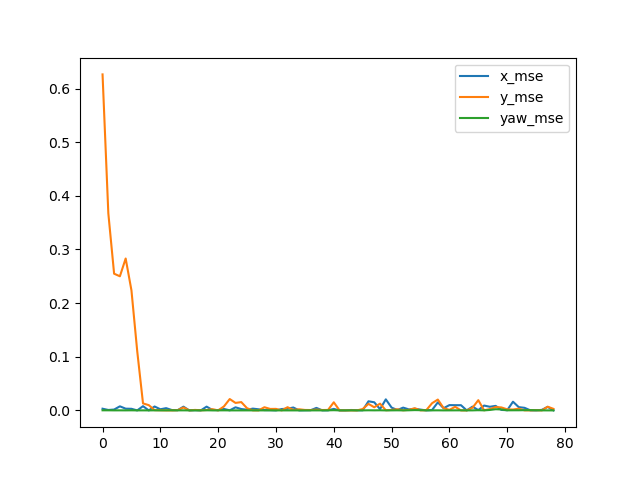

# Lab 2: Monte Carlo Localization

## 3: Implementation

Demo can be found [here](https://drive.google.com/file/d/115FHaQ_TWuClRmV8bdQhPumzo02W5NWF/view?usp=drive_link).

Error graph is shown below:

## 4: Output

1. We start with a model variance for X and Y to be 0.5.

    When decreasing the model variance for X and Y to 0.01, the density of particles increased greatly, becoming more concentrated in a small point. A smaller variance leads to less noise, so the particles have a smaller error (in euclidian distance) from the true pose.

    On the other hand, when increasing the model variance for X and Y to be 10.0, the particles are much more spread out, becoming less concentrated around a point. A larger variance leads to more noise, so the particles have a larger error (again in euclidian distance) from the true pose.

2. We start with 2,000 particles.

    When decreasing the number of particles to 100, the computation is significantly faster, and the program ends swiftly. However, we observe that, for the most part, the belief of the true pose is in the wrong place, and it's not until the very end that the localization is actually correct.

    On the other hand, when increasing the number of particles to 10,000, the computation is significantly slower. However, since 2,000 particles was accurate enough to determine the correct position of the robot, increasing it to 10,000 did offer significant improvements in MSE or the true robot pose.

3. A single particle in general is unable to represent the complex posterior distribution of the system state. Even if it starts in the correct position, the inherent noise & uncertainty is likely to deviate the particle from its true state. It is possible however, in a very unlikely system with no noise, for a single particle to perform well in localizing the position of the robot.

## 5: Extra Credit

TODO

## 6: Additional Questions

### 6.1: Resources Consulted

- https://numpy.org/doc/ — General Numpy documentation

### 6.2: Team Contributions

- Rohan: first part of code
- Scott: second part of code
- Matt: third part of code
- Harshitha: playing with different values to answer the questions
